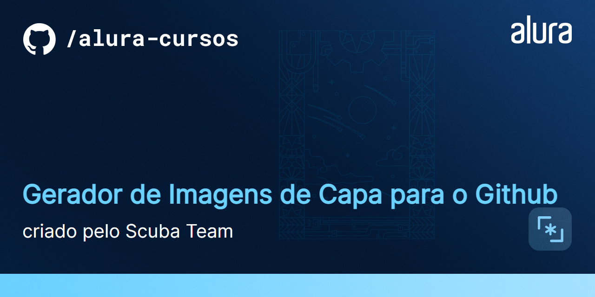
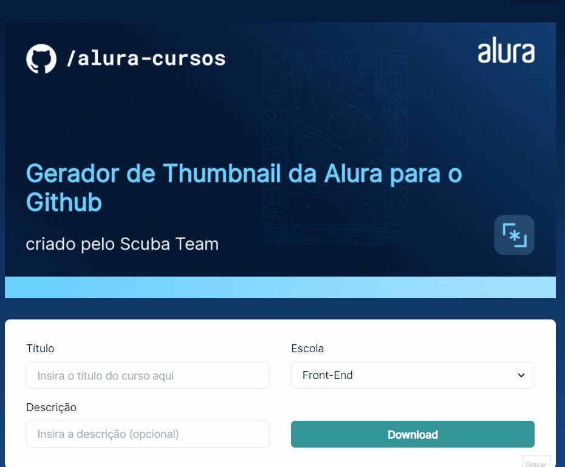

[](https://alura-github-thumbnail-generator.vercel.app/)

# Gerador de Thumbnail da Alura para o Github

## 📁 Acesso ao projeto

Link do projeto: 
[https://alura-github-thumbnail-generator.vercel.app/](https://alura-github-thumbnail-generator.vercel.app/) ou clique na imagem acima.


## 🔨 Funcionalidades do projeto

Gerar uma imagem contendo título, descrição e escola de um curso, utilizando o Template criado pela Helena Navarro.

## ▶️ Como usar



## ✔️ Técnicas e tecnologias utilizadas

- [Templates de Thumbnail para o Github](https://docs.google.com/presentation/d/1im_-_spDdNEEsfrmjeZet2ZzVKjG-sQSBWfPFJhZ4q0/edit#slide=id.gb6f422ab58_0_111)
- Next.js
- Chakra UI
- puppeteer

### ♟️ Componentes
#### Thumbnail
Responsável por posicionar o título e a descrição em cima da imagem template.

### ⚙️ Configurações
Trocar o `BASE_URL` de acordo com o ambiente (prod vs dev)


### 📄 Páginas
#### api/thumbnail
Repassa os valores `title`, `description` e `type` para a função `getScreenshot` e retorna a imagem recebida.

#### thumbnail
Página gerada com SSR com o propósito de renderizar o componente `Thumbnail` com as informações de `title`, `description` e `type` passados como *query params*


### 🧰 Utilidades
#### buildUrl
Constroi a URL de requisição da api utilizando os valores `title`, `description` e `type`

#### getThumbnail
Contém as configurações do puppeteer e o método `getScreenshot` responsável por inicializar o puppeteer, acessar a página `/thumbnail`, tirar uma screenshot e retorná-la.

### 👀 Hooks
#### useTimeout
Lida com a lógica de cancelar a execução do *callback* criado pelo `setTimeout` caso o componente seja desmontado.

#### useDebounce
**Contexto:** A criação da imagem ocorre no acesso à `/api/thumbnail/`. A URL da imagem de preview está associada a um estado da página que muda em todo `onChange` dos *inputs* do formulário. Ou seja, cada vez que o usuario digita algo em um campo uma nova requisição seria feita. Porém este processo é custoso (renderizar a página no servidor, inicializar puppeteer, tirar screenshot e devolver para o cliente) e poderia causar o sobrecarregamento da *serverless function*, além de estar gerando imagens que não seriam utilizadas.

Este hook observa um valor `x` (estados dos *inputs*) e executa seu *callback* (mudar URL) somente quando não há mudanças em `x` num intervalo de tempo maior que o informado (neste caso 500 ms). Sendo assim, `api/thumbnail/` só será acessada após 500 ms da última interação do usuário com os *inputs* 

### 🎨 Tema
Cria tema da Alura (baseado no Brandbook) no ChakraUI.


## 🛠️ Abrir e rodar o projeto

1. Clone o repositório
```bash
git clone https://github.com/edukure/alura-github-thumbnail-generator.git
```

2. Acesse a pasta
```bash
cd alura-github-thumbnail-generator
```

3. Instale as dependências
```bash
yarn install
```

4. Rode o projeto
```bash
yarn dev
```

5. Acesse [http://localhost:3000](http://localhost:3000)
